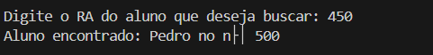

# Casos de Teste

### Teste 1: Inserção de Alunos

 Nesse teste o objetivo é ver se o código está inserindo corretamente os alunos nos nós da Tabela Hash Distribuída (DHT)com base na RA. A inserção é para amarzenar as informações de um aluno no nó responsável por aquela chave, fazendo com que siga a regra do Chord. Para isso cada nó tem um identificador único , e os dados devem ser inseridos no nó que tenha o menor ID maior ou igual ao RA do aluno.
 Para fazer esse teste no terminal eu coloquei o seguinte comando `g++ -o dht main.cpp chord.cpp aluno.cpp -std=c++17
` 
que isso faz com que conseguimos traduzir o código escrito em C++, em seguida no terminal coloquei esse comando  `./dht
` que é para rodar o código. Assim inícia o funcionamento da Tabela Hash Distribuída. 
O protocolo Chord distribui os dados com base no valor da chave (RA) e nos identificadores dos nós. O sistema deve armazenar cada aluno no nó com o menor ID maior ou igual ao RA.

Distribuição esperada:

**RA 450 → Nó 500**

**RA 3500 → Nó 4000**

**RA 6200 → Nó 7000**

**RA 400 → Nó 500**

essa foi a saída do terminal: 

 
  
  
  

Com isso o sistema inseriu corretamente a lógica dos alunos, distribuindo os alunos entre os nós adequados. Ou seja  a lógica de inserção baseada no protocolo Chord deu certa.

### Teste 2: Buscar Aluno Existente 

O objetvo desse teste é verificar se o sistema consegue buscar um aluno inserido na Tabela Hash Distribuída (DHT), utilizando o RA como chave de pesquisa. A busca vai em localizar o nó responsável por armazenar o aluno e recuperar as suas informações, exibindo o resultado no terminal. Para o teste eu utilizei um RA conhecido. 
 Para fazer esse teste no terminal eu coloquei o seguinte comando `g++ -o dht main.cpp chord.cpp aluno.cpp -std=c++17
` 
que isso faz com que conseguimos traduzir o código escrito em C++, em seguida no terminal coloquei esse comando  `./dht
` que é para rodar o código. Assim inícia o funcionamento da Tabela Hash Distribuída. 
O que acontece durante a execução: o sistema solicita um RA a ser buscado. O valor que coloquei foi **450** que é o Pedro. Quando eu coloco esse valor no terminal o sistema começa a busca, aplicando a lógica definida pelo protocolo Chord. Assim , para o RA 450, o nó responsável pela busca foi o nó 500, pois é o primeiro nó que identificada maior ou igual a 450. O sistema, então, acessou o nó 500, buscou a chave correspondente e retornou as informações do aluno, exibindo a mensagem no terminal.  
Essa foi a saída no terminal: 

 
  
  
  

Assim conseguimos ver que o sistema funcionou conforme o esperado. 

### Teste 3: Remoção de Aluno 
O objetivo deste teste é verificar se o sistema consegue remover corretamente um aluno inserido na Tabela Hash Distribuída (DHT). 
 Para fazer esse teste no terminal eu coloquei o seguinte comando `g++ -o dht main.cpp chord.cpp aluno.cpp -std=c++17
` 
que isso faz com que conseguimos traduzir o código escrito em C++, em seguida no terminal coloquei esse comando  `./dht
` que é para rodar o código. Assim inícia o funcionamento da Tabela Hash Distribuída. 
Para fazer o teste colocaremos um número no terminal para sinalizar qual aluno queremos remover. Para esse teste utilizei o número 450, que seria o aluno Pedro.  sistema, então, iniciou o processo de remoção, seguindo a lógica definida pelo protocolo Chord. Assim como nas operações anteriores, o sistema percorreu a lista de nós disponíveis para identificar o nó responsável pelo RA fornecido. Em seguida no terminal deveria aparecer que o aluno RA foi removido. 
 
A seguir mostra o que apareceu no meu terminal após colocar 450:

 
  
  
  

Assim conseguimos ver que o código conseguiu remover o aluno corretamente. 
Porém outra mensagem foi mostrada no terminal, isso mostra que antes armazenava os alunos Pedro (RA 450) e João (RA 400), agora contém apenas o registro do aluno João, mostrando que a remoção foi realizada com sucesso. Os demais nós estão com a estrutura igual. 

### Teste 4: Buscar aluno que não existe 
O objetivo deste teste é verificar se o sistema consegue identificar a ausência de um aluno na Tabela Hash Distribuída (DHT). 
 Para fazer esse teste no terminal eu coloquei o seguinte comando `g++ -o dht main.cpp chord.cpp aluno.cpp -std=c++17
` 
que isso faz com que conseguimos traduzir o código escrito em C++, em seguida no terminal coloquei esse comando  `./dht
` que é para rodar o código. Assim inícia o funcionamento da Tabela Hash Distribuída. 
Para fazer o teste precisei colocar uma RA no terminal para que possa iniciar a busca, para esse teste coloquei o número 99999. O sistema então vai começar a busca, verificando se existe algum RA na lista de nós. Em seguida o terminal deveria mandar uma mensagem informado se aquele aluno foi encontrado ou não.  
A seguir, a imagem mostra o que o terminal deu como resultado. 

 
  
  
  

Assim vemos que o teste deu certo, pois o código mostrou que esse RA realmente não existe. 

### Teste 5: Excluir aluno que não existe
O objetivo deste teste foi verificar se o sistema consegue identificar corretamente a tentativa de remoção de um aluno que não existe na Tabela Hash Distribuída (DHT). 
Para fazer esse teste no terminal eu coloquei o seguinte comando `g++ -o dht main.cpp chord.cpp aluno.cpp -std=c++17
` 
que isso faz com que conseguimos traduzir o código escrito em C++, em seguida no terminal coloquei esse comando  `./dht
` que é para rodar o código. Assim inícia o funcionamento da Tabela Hash Distribuída. 
Durante a execução, o sistema solicitou ao usuário o número do RA correspondente ao aluno que deveria ser removido. Para este teste, foi inserido o RA 9999, um valor que não corresponde a nenhum aluno. O sistema, então, iniciou o processo de remoção, seguindo a lógica definida pelo protocolo Chord. Assim como nas operações de remoção anteriores, o sistema percorreu a lista de nós existentes na DHT e identificou o nó responsável pelo RA fornecido. Como não existe essa RA a mensagem deveria sair "Aluno não encontrado para remoção."

A seguir vemos o resultado no terminal após inserir 99999:

 
  
  
  

Como podemos ver na imagem o resultado esperado não foi atendido, pois falou que que o aluno havia sido removido com sucesso, mesmo sem existir no sistema. Além disso, o estado da DHT permaneceu inalterado, mostrando que a remoção não foi realizada. Esse problema pode ter acontecido no método ` removerAluno` no arquivo  `main.cpp`, que exibia a mensagem de sucesso sem verificar o retorno da função `deleteKey`. O método responsável pela remoção retornava false quando o RA não era encontrado, mas essa informação não estava sendo utilizada para determinar a mensagem  no terminal.